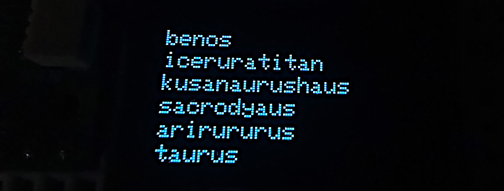
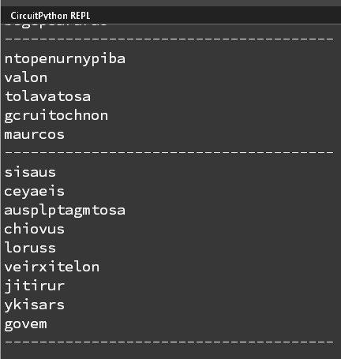
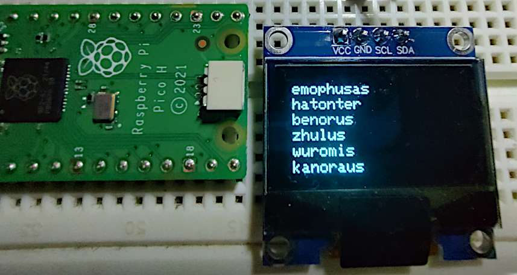

# Text generation on microcontrollers with CircutPython and  Markov Chains

This code generates random text using charactor level [Markov Chains](https://en.wikipedia.org/wiki/Markov_chain). It has been written for [CircuitPython](https://docs.circuitpython.org/en/latest/README.html) and should run on [wide variety of boards](https://blog.adafruit.com/2019/01/26/circuitpython-is-supported-on-28-boards-and-2-more-that-are-shipping-but-not-in-releases-yet-for-a-total-of-30-different-boards-circuitpython-adafruit-arduino-bwshockley-electronicats-makerd/) supporting it. By default the code creates a charactor level Markov Chain which can be used for generating random dinosaur names. You can train a charactor level Markov Chain model on any time of data  using this code.

## Why CircuitPython and Markov Chains ?
- C++ is hard. Setting up dev enviornment for TFlite and board's SDK can be challenging for newbies.
- CircuitPython has many useful libraries available out of box.
- Loading Tflite models is currently not supported by CircuitPython. Checkout [this open source project](https://github.com/mocleiri/tensorflow-micropython-examples)s for work in direction of making this possible (doesn't work for all boards as of now).
- RNNs are complicated and use more memory.
- Markov Chains are simpler and lightweight !

## Steps to run

- Download the file https://raw.githubusercontent.com/junosuarez/dinosaurs/master/dinosaurs.csv
- Generate a markov chain model from your text file using **generate_chain.py**.  
- Copy **generate_text.py**, **marker_chain_parser.py** and **dino_chain.json** to your CircuitPython device.
- Check output on a serial monitor.

> Alternatively you skip steps 1 and 2 and   run the 'text-generation-on-microcontrollers.ipynb' Jupyter notebook to generate **dino_chain.json**. This notebook is also available on Kaggle: https://www.kaggle.com/code/finalepoch/text-generation-on-microcontrollers

## Output on serial monitor (generate_text.py)

## Output on OLED display (generate_text_oled.py)

This program requires an I2C OLED display (128x64) to be connected to the board. The example assumes Pi Pico board, so the OLED is connect to GP5(SLK) and GP4(SDA)

